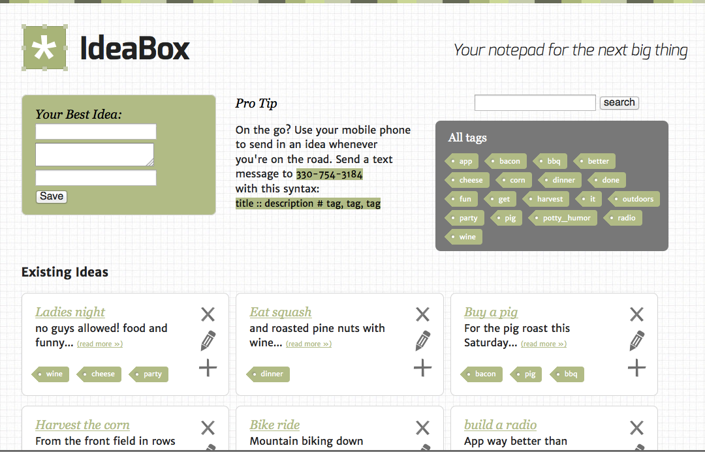

idea_box
========

IdeaBox - a Sinatra web app based on the [Jumpstart Lab project](http://tutorials.jumpstartlab.com/projects/idea_box.html) during gSchool.

## Background & Overview

- Test suite is built with RackTest, MiniTest and Capybara
- IdeaBox was an independent work project built around a JumpStartLabtutorial, with expansions including SMS texting using Twilio, a custom-built HTML/CSS template, and a test suite.

## Constraints

- Use a YAMLStore file database
- Don't use ActiveRecord

## Why It's Not Live Yet
Due to the use of YAMLStore database, and the intricacies of persisting the file database on Heroku, this project is not yet live. I have plans of porting it to Rails using PostgreSQL soon.

## System Requirements
- Ruby 2.0.0
- Sinatra
- Bundler

## How to Use

- Clone the repository
- Change into the directory from your terminal
- run `bundle install`
- run the command `rackup` (or `rackup -p portnumber`)
- visit the site at `localhost:9292` (or you specified port number)

